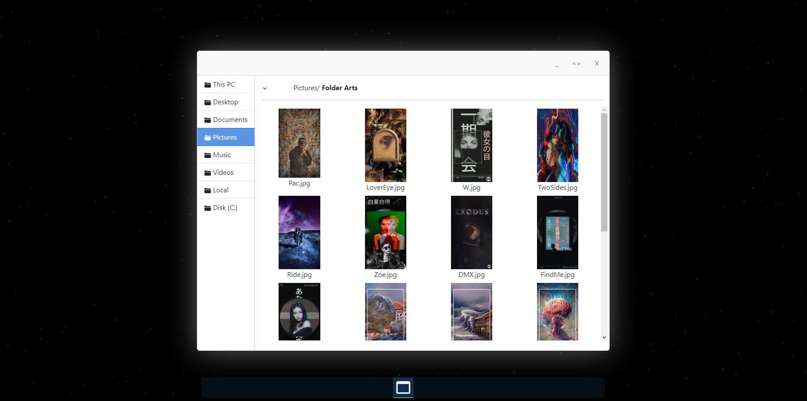

# React Digital Art Gallery Project

## Project Overview

This project is a simplistic digital art gallery built using React. The gallery displays a collection of digital artworks and allows users to navigate through them. 

Fully done in frontend without backend. All images are collected from *assets/imgs* folder.



Check it on desktop/laptop [gallery](http://gallery.benaminbambur.com) .

## Installation

First, navigate to the root directory of your React project using the terminal.

```bash
npm install
```


```bash
npm run dev
```

Thats it. 

## License

MIT License

Copyright (c) 2023 Benamin Bambur

Permission is hereby granted, free of charge, to any person obtaining a copy
of this software and associated documentation files (the "Software"), to deal
in the Software without restriction, including without limitation the rights
to use, copy, modify, merge, publish, distribute, sublicense, and/or sell
copies of the Software, and to permit persons to whom the Software is
furnished to do so, subject to the following conditions:

The above copyright notice and this permission notice shall be included in all
copies or substantial portions of the Software.

THE SOFTWARE IS PROVIDED "AS IS", WITHOUT WARRANTY OF ANY KIND, EXPRESS OR
IMPLIED, INCLUDING BUT NOT LIMITED TO THE WARRANTIES OF MERCHANTABILITY,
FITNESS FOR A PARTICULAR PURPOSE AND NONINFRINGEMENT. IN NO EVENT SHALL THE
AUTHORS OR COPYRIGHT HOLDERS BE LIABLE FOR ANY CLAIM, DAMAGES OR OTHER
LIABILITY, WHETHER IN AN ACTION OF CONTRACT, TORT OR OTHERWISE, ARISING FROM,
OUT OF OR IN CONNECTION WITH THE SOFTWARE OR THE USE OR OTHER DEALINGS IN THE
SOFTWARE.
